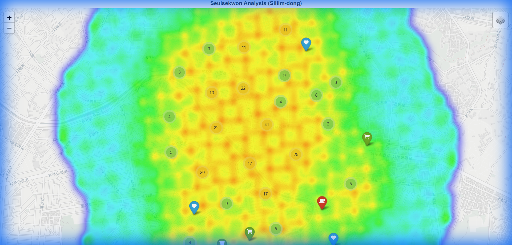

# 🚶 Seulsekwon Analysis (슬세권 분석)

**"Slippers + Area" Analysis: Finding the best living areas for single-person households in Seoul.**

## 📌 Project Overview (프로젝트 개요)
이 프로젝트는 **'슬세권(슬리퍼를 신고 편의시설을 이용할 수 있는 권역)'** 지수를 산출하고 시각화하는 파이썬 분석 도구입니다.
단순히 시설의 개수를 세는 것이 아니라, 1인 가구에게 필수적인 **카페, 운동시설, 편의점**과의 **거리 붕괴 함수(Distance Decay Function)**를 적용하여 실제 생활 편의성을 정량적으로 평가합니다.


*(실제 실행 시 seulsekwon_map.html 파일로 인터랙티브 지도가 생성됩니다)*

## 🎯 Key Features (핵심 기능)
1.  **Multi-Factor Scoring**: 카페, 헬스장, 편의점의 복합적인 접근성을 분석합니다.
2.  **Distance Decay Algorithm**: 거리가 멀어질수록 점수가 선형적으로 감소하는 정교한 채점 방식을 사용합니다. (100m 이내 10점 ~ 1km 이상 0점)
3.  **Fast Spatial Indexing**: `KDTree` 알고리즘을 사용하여 대용량 위치 데이터의 거리를 수 초 내에 계산합니다.
4.  **Interactive Visualization**:
    *   **Heatmap**: 편의시설 밀집도를 붉은색 히트맵으로 시각화.
    *   **Marker Clustering**: 개별 시설물(상호명 포함)을 종류별 아이콘으로 클러스터링하여 표시.

## 🛠️ Technology Stack
- **Language**: Python 3.8+
- **Data Processing**: Pandas, GeoPandas, NumPy, Shapely
- **Visualization**: Folium (Leaflet.js based)
- **Algorithm**: Scipy (Spatial KDTree)

## 🚀 How to Run (실행 방법)

### 1. Prerequisites (준비물)
파이썬 환경이 필요합니다. 아래 명령어로 필수 라이브러리를 설치하세요.
```bash
pip install -r requirements.txt
```

### 2. Run Dashboard (대시보드 실행)
Streamlit을 통해 인터랙티브 대시보드를 실행합니다.
```bash
streamlit run streamlit_app.py
```
실행 후 브라우저가 자동으로 열리며 `http://localhost:8501`에서 확인 가능합니다.

## 📂 File Structure (파일 구조)
이 저장소에 포함된 핵심 파일들은 다음과 같습니다. **이 파일들을 모두 GitHub에 올리시면 됩니다.**

| 파일명 | 설명 |
|---|---|
| **`streamlit_app.py`** | 🌟 **메인 파일**: 대시보드 UI 및 전체 로직 통합 |
| `algorithm.py` | 🧠 **알고리즘**: 슬세권 지수 산출 및 KDTree 공간 연산 |
| `data_processor.py` | 💾 **데이터 처리**: 공공데이터 로딩 및 안전/의료 Mock 데이터 생성 |
| `requirements.txt` | 📦 **패키지**: 프로젝트 실행에 필요한 라이브러리 목록 |
| `README.md` | 📖 **설명서**: 프로젝트 소개 및 실행 가이드 (현재 파일) |
| `visualization.py` | 🎨 (Legacy) 정적 지도 생성 모듈 |
| `main.py` | 🏗️ (Legacy) 정적 지도 생성 스크립트 |

## 📊 Logic Details (분석 로직)
**통합 슬세권 지수 (Integrated Seulsekwon Index)**
- **기본항목**: 카페, 헬스장, 편의점
- **신규항목**: 👮안전(1.5배 가중치), 🏥의료(1.2배 가중치), 🧺생활편의
- **알고리즘**: $$S(d) = \sum (Weight \times DistanceDecay(d))$$
  - 모든 시설물에 대해 거리 기반 감쇠 함수를 적용하여 합산합니다.

---
*Created by Antigravity*
